# Installation guide (Ru) | Инструкция по установке
### Краткие сведения о ПО
ПО состоит из двух основных частей - клиентской и серверной.  
Сервер отвечает за обработку задач и не имеет графического интерфейса.  
Клиент отвечает за отображение интерфейса взаимодействия с сервером, предоставляет возможность реализовывать основные функции программы при помощи графической утилиты.

Серверная часть реализована на Java (17+) и Spring Boot.  
Клиентская часть реализована на Python (v. 3.8.0 - 3.10.0) и QT5.

Обмен данными между клиентом и сервером - Json по RestAPI.  
Поддерживаются OC: Linux/Windows/MacOS.  
ПО рассчитано на создание сторонних клиентов и дальнейшее расширение функционала.

## Инструкция по установке для OC на базе Linux
*в данном случае представлена установка для систем на базе Debian
### Настройка и запуск серверной части

1. Установить язык Java (v. 17.0.0 - 17.0.12) при его отсутствии

```bash
sudo apt update && sudo apt upgrade -y
sudo apt install openjdk-17-jdk openjdk-17-jre
```

2. Распаковать архив с программой

```bash
cd ~/<куда_скачали>
unzip task_manager-1.0.zip -d <task_manager-1.0>
```

3. Запустить терминал (в зависимости от OC способ может отличаться)
Нажимаем сочетание `ctrl` + `alt` + `t`
4. Перейти в папку с скриптом сервера:

```bash
cd ~/<место_распаковки>/task_manager-1.0/src/server/task_sheduler
```

5. Запустить скрипт командой:

```bash
java -jar current_build/task_sheduler-1.0-SNAPSHOT.jar
```

* Для работы сервера скрипт должен оставаться запущенным, база данных сохраняется при следующих запусках.


### Настройка и запуск клиентской части

1. Установить Python (v. 3.8.0 - 3.10.0)
На Linux python установлен по умолчанию, рекомендуется обновить/откатиться до версии 3.10.
Проверить текущую версию можно прописав в терминал:

```bash
python3 --version
```

2. Распаковать архив с программой
3. Запустить терминал  
Нажимаем сочетание `ctrl` + `alt` + `t`
4. Перейти в папку с программой клиента через терминал
Пишем в терминале:

```bash
cd ~/<куда_распаковали>/task_manager/src/client
```

5. (Опционально) Установить виртуальное окружение python
Прописываем команды в терминал:

```bash
sudo apt install python3-venv
python3 -m venv venv
source venv/bin/activate
```

6. Установить все зависимости командой `pip install -r requirements.txt`
7. В файле конфигурации `config.json` в папке программы задать в параметре url адрес и порт сервера (при тестовом запуске можно не редактировать)
8. Для запуска программы программы в режиме обычного пользователя написать в терминале:

```bash
python3 user.py
```

9. Для запуска программы программы в режиме администратора написать в терминале:

```bash
python3 admin.py
```

Пример работы с программой приведен в прилагаемом видео.

## Инструкция по установке для Windows 10/11


### Настройка и запуск серверной части

1. Установить язык Java (v. 17.0.0 - 17.0.12) при его отсутствии
Установка Java 17 производится с [официального сайта](https://www.oracle.com/java/technologies/downloads/#jdk17-windows)

* Необходимо выбрать в списке в нижней части экрана версию `JDK 17` и загрузить установщик `x64 MSI Installer`

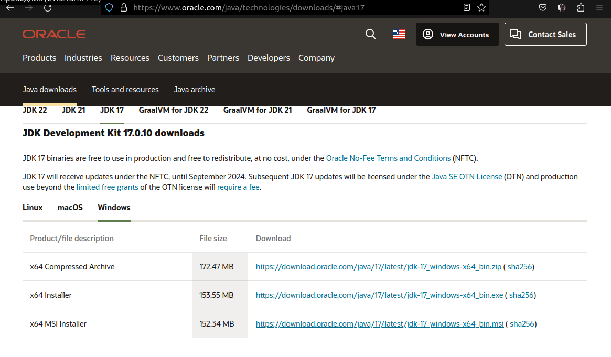

* Запустить загрузчик, нажать `Install`

После установки нужно указать системные переменные:

* В строке поиска Windows найти "Изменение переменных среды"
* Нажмите `Переменные среды`

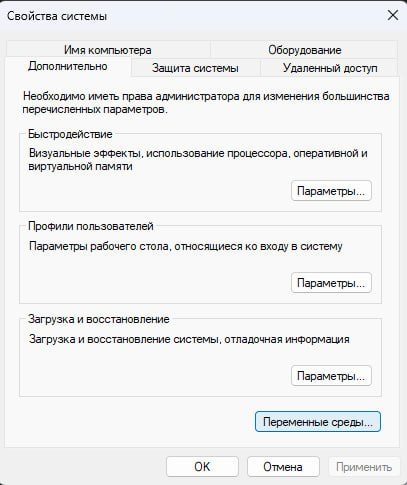

* В разделе `Системные переменные` нажмите `Создать`.

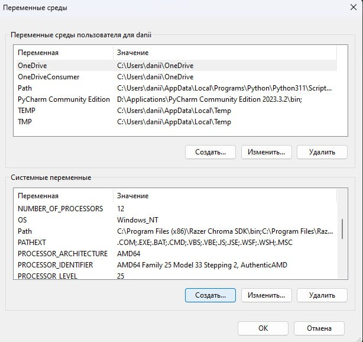

* Скопируйте путь до папки `Java\jdk-17\bin` из проводника, пройдя по пути: диск C -> Program Files или Program Files (x86) -> Java -> jdk-17 -> bin, затем нажав правой кнопкой мыши на папку в меню навигации и выбрав `скопировать путь как текст`

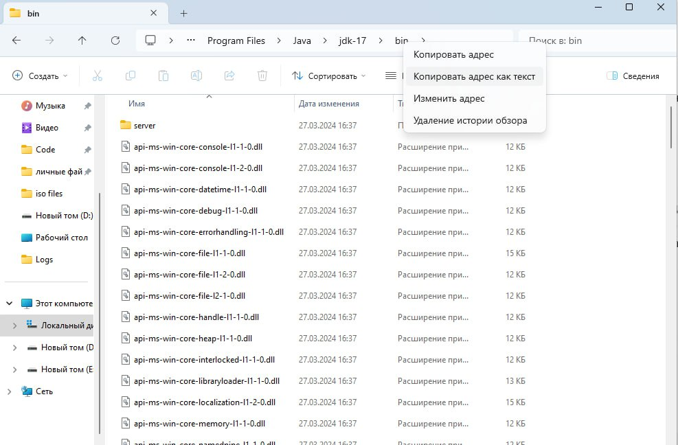

* В окне создания системной переменной укажите имя переменной `JAVA_HOME`, в значении укажите только что скопированный путь

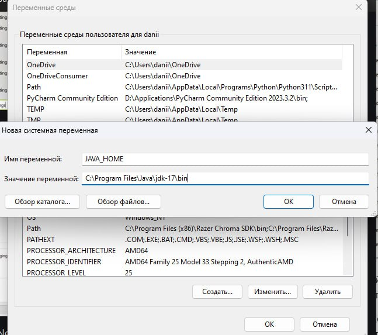

* Выберите переменную Path и нажмите `Изменить`

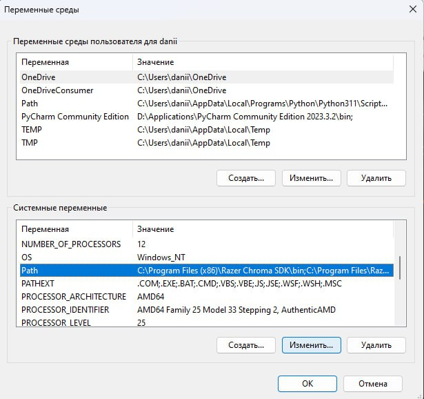

* Нажмите `Создать`

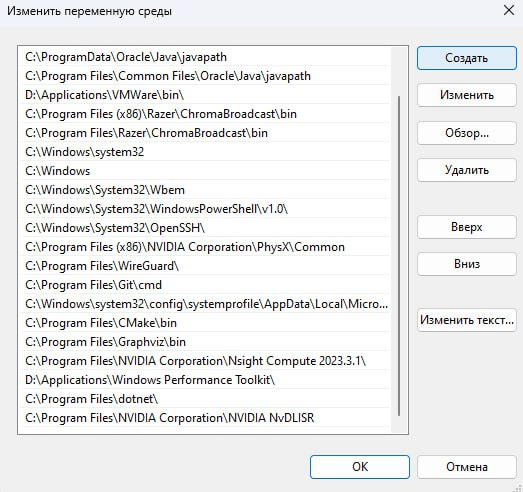

* Укажите значение " %JAVA_HOME% "

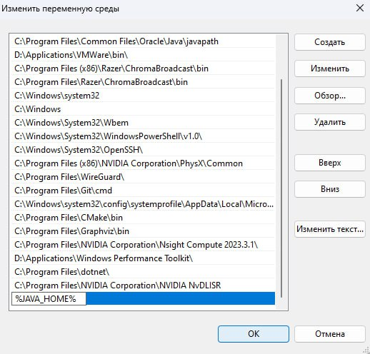

* Нажмите `OK`. Закройте остальные открытые окна, нажимая `OK`


2. Распаковать архив с программой.
3. Запустить терминал: нажимаем сочетание `Win` + `r` и в открывшемся окошке пишем `cmd`, нажимаем `Enter` 
4. Перейти в папку с скриптом сервера (`src/server/task-scheduler/`). Нужно скопировать путь к папке аналогично тому, как это делалось при установке Java:

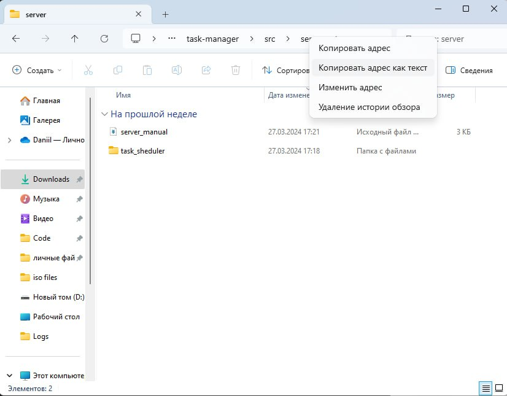

Перейти в папку с скриптом сервера:

```bash
cd <скопированный_ранее_путь>
```

5. Запустить сервер командой в терминале:

```bash
java -jar current_build/task_sheduler-1.0-SNAPSHOT.jar
```

* Для работы сервера скрипт должен оставаться запущенным, база данных сохраняется при следующих запусках.

### Настройка и запуск клиентской части
*в данной версии программы при условии установки всех зависимостей для удобства пользователя предусмотрен запуск программ клиенсткой части при помощи файлов расширения .exe, которые находятся в директории exe_files.  
Для запуска программы в режиме обычного пользователя или администратора достаточно зайти в соответствующие директории и запустить файлы `постановщик задач.exe`и `администратор постановщик задач.exe` соотвественно. После запуска файлов на экране появится стандартный графический интерфейс для взаимодействия с системой.

1. Установить язык Python (v. 3.8.0 - 3.10.0) с [официального сайта](https://www.python.org/downloads/release/python-3120/) при его отсутствии. Рекомендуем установить версию 3.10
2. Запустить терминал: нажимаем сочетание `Win` + `r` и в открывшемся окошке пишем `cmd`, нажимаем `Enter` 
3. Листаем вниз сайта и скачиваем Windows installer (64-bit)

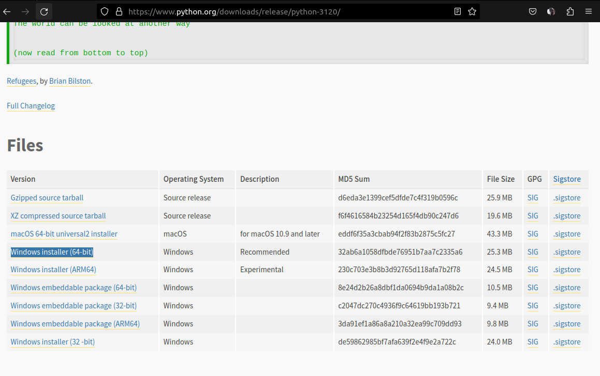

4. При установке отмечаем все галочки и нажимаем `Install Now` (данный пример иллюстрирует общий процесс установки языка, его версия не обязательно должна совпадать с той, что показана на изображении). После установки перезагружаем компьютер.

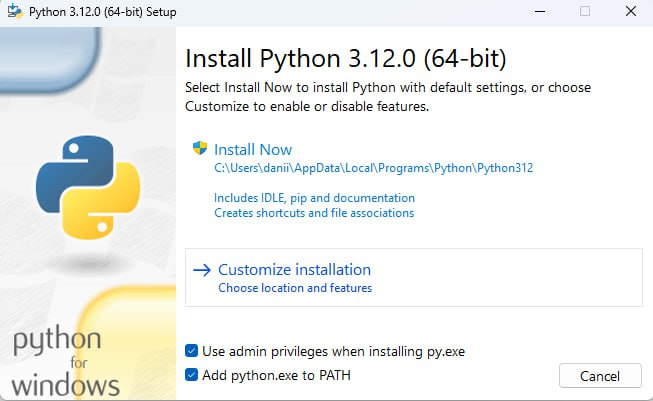

5. Перейти в папку с программой клиента (`src/client/`). Нужно скопировать путь к папке:

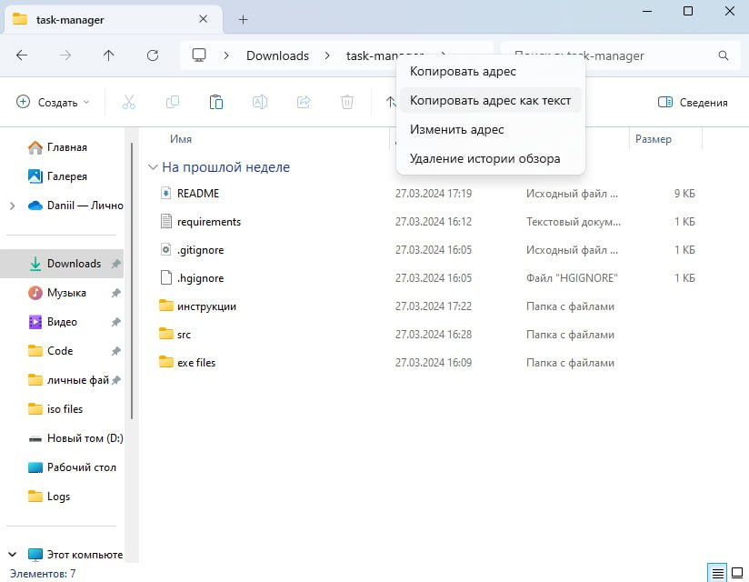

Затем пишем в терминале команды и после каждой нажимаем `Enter`:  

```bash
d:
cd <вставляем скопированный путь>
```

6. Установить необходимые зависимости  
Пишем в терминале и нажимаем `Enter`:
```bash
pip install -r requirements.txt
```

7. В файле конфигурации `config.json` в папке программы задать в параметре url адрес и порт сервера (при тестовом запуске можно не редактировать).
8. Для запуска программы в режиме обычного пользователя
необходимо выполнить команду в терминале, перейдя в папку `task-manager`:

```bash
python src/client/client.py
```

9. Для запуска программы в режиме администратора необходимо сделать то же самое, но с дополнительным параметром `admin`:

```bash
python src/client/client.py admin
```
